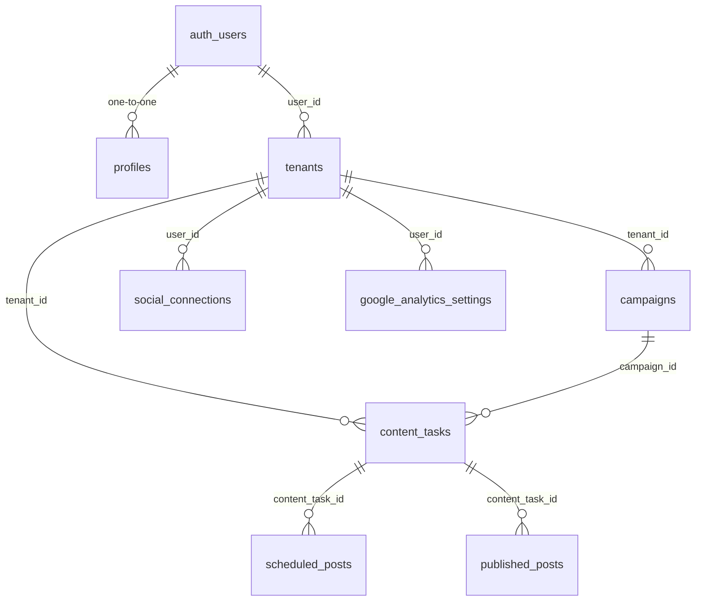

# Database Documentation

## Database Overview
The application uses Supabase PostgreSQL with Row Level Security (RLS) for multi-tenant data isolation.

## Schema Architecture



## Core Tables

### Authentication & Users

#### `auth.users` (Supabase managed)
Core authentication table managed by Supabase Auth.

#### `public.profiles`
Extended user profile information.
```sql
CREATE TABLE public.profiles (
    id UUID PRIMARY KEY DEFAULT gen_random_uuid(),
    user_id UUID REFERENCES auth.users NOT NULL UNIQUE,
    display_name TEXT,
    avatar_url TEXT,
    bio TEXT,
    created_at TIMESTAMP WITH TIME ZONE DEFAULT NOW(),
    updated_at TIMESTAMP WITH TIME ZONE DEFAULT NOW()
);
```

**RLS Policies**:
- Users can view all profiles (public information)
- Users can only update their own profile

#### `public.tenants`
Multi-tenant organization structure.
```sql
CREATE TABLE public.tenants (
    id UUID PRIMARY KEY DEFAULT gen_random_uuid(),
    name TEXT NOT NULL,
    slug TEXT UNIQUE NOT NULL,
    user_id UUID REFERENCES auth.users NOT NULL,
    settings JSONB DEFAULT '{}',
    subscription_status TEXT DEFAULT 'trial',
    trial_ends_at TIMESTAMP WITH TIME ZONE,
    created_at TIMESTAMP WITH TIME ZONE DEFAULT NOW(),
    updated_at TIMESTAMP WITH TIME ZONE DEFAULT NOW()
);
```

**Indexes**:
- `idx_tenants_user_id` on `user_id`
- `idx_tenants_slug` on `slug`

### Content Management

#### `public.content_tasks`
Core content creation and management.
```sql
CREATE TABLE public.content_tasks (
    id UUID PRIMARY KEY DEFAULT gen_random_uuid(),
    user_id UUID REFERENCES auth.users NOT NULL,
    tenant_id UUID REFERENCES tenants NOT NULL,
    campaign_id UUID REFERENCES campaigns,
    title TEXT NOT NULL,
    content_type TEXT NOT NULL, -- 'instagram_post', 'facebook_post', etc.
    status TEXT DEFAULT 'draft', -- 'draft', 'in_review', 'approved', 'published'
    generated_content TEXT,
    approved_content TEXT,
    media_urls TEXT[],
    metadata JSONB DEFAULT '{}',
    created_at TIMESTAMP WITH TIME ZONE DEFAULT NOW(),
    updated_at TIMESTAMP WITH TIME ZONE DEFAULT NOW()
);
```

**Indexes**:
- `idx_content_tasks_user_id` on `user_id`
- `idx_content_tasks_tenant_id` on `tenant_id`
- `idx_content_tasks_campaign_id` on `campaign_id`
- `idx_content_tasks_status` on `status`

#### `public.campaigns`
Marketing campaign organization.
```sql
CREATE TABLE public.campaigns (
    id UUID PRIMARY KEY DEFAULT gen_random_uuid(),
    user_id UUID REFERENCES auth.users NOT NULL,
    tenant_id UUID REFERENCES tenants NOT NULL,
    title TEXT NOT NULL,
    description TEXT,
    start_date DATE,
    end_date DATE,
    status TEXT DEFAULT 'active',
    target_audience TEXT,
    budget_allocated DECIMAL(10,2),
    metadata JSONB DEFAULT '{}',
    created_at TIMESTAMP WITH TIME ZONE DEFAULT NOW(),
    updated_at TIMESTAMP WITH TIME ZONE DEFAULT NOW()
);
```

### Social Media Integration

#### `public.social_connections`
OAuth connections to social media platforms.
```sql
CREATE TABLE public.social_connections (
    id UUID PRIMARY KEY DEFAULT gen_random_uuid(),
    user_id UUID REFERENCES auth.users NOT NULL,
    platform TEXT NOT NULL, -- 'facebook', 'instagram'
    platform_user_id TEXT NOT NULL,
    access_token TEXT NOT NULL,
    refresh_token TEXT,
    expires_at TIMESTAMP WITH TIME ZONE,
    is_active BOOLEAN DEFAULT TRUE,
    account_name TEXT,
    account_avatar TEXT,
    permissions TEXT[],
    metadata JSONB DEFAULT '{}',
    created_at TIMESTAMP WITH TIME ZONE DEFAULT NOW(),
    updated_at TIMESTAMP WITH TIME ZONE DEFAULT NOW()
);
```

**Security**: Access tokens are stored encrypted and only accessible via RLS policies.

#### `public.scheduled_posts`
Content scheduled for future publishing.
```sql
CREATE TABLE public.scheduled_posts (
    id UUID PRIMARY KEY DEFAULT gen_random_uuid(),
    content_task_id UUID REFERENCES content_tasks NOT NULL,
    user_id UUID REFERENCES auth.users NOT NULL,
    platform TEXT NOT NULL,
    scheduled_for TIMESTAMP WITH TIME ZONE NOT NULL,
    status TEXT DEFAULT 'scheduled', -- 'scheduled', 'publishing', 'published', 'failed'
    retry_count INTEGER DEFAULT 0,
    error_message TEXT,
    created_at TIMESTAMP WITH TIME ZONE DEFAULT NOW(),
    updated_at TIMESTAMP WITH TIME ZONE DEFAULT NOW()
);
```

#### `public.published_posts`
Record of successfully published content.
```sql
CREATE TABLE public.published_posts (
    id UUID PRIMARY KEY DEFAULT gen_random_uuid(),
    content_task_id UUID REFERENCES content_tasks NOT NULL,
    user_id UUID REFERENCES auth.users NOT NULL,
    platform TEXT NOT NULL,
    platform_post_id TEXT NOT NULL,
    published_at TIMESTAMP WITH TIME ZONE NOT NULL,
    engagement_metrics JSONB DEFAULT '{}',
    performance_data JSONB DEFAULT '{}',
    created_at TIMESTAMP WITH TIME ZONE DEFAULT NOW(),
    updated_at TIMESTAMP WITH TIME ZONE DEFAULT NOW()
);
```

### Analytics & Reporting

#### `public.google_analytics_settings`
Google Analytics integration configuration.
```sql
CREATE TABLE public.google_analytics_settings (
    id UUID PRIMARY KEY DEFAULT gen_random_uuid(),
    user_id UUID REFERENCES auth.users NOT NULL UNIQUE,
    property_id TEXT NOT NULL,
    connection_status TEXT DEFAULT 'disconnected',
    service_account_configured BOOLEAN DEFAULT FALSE,
    last_test_at TIMESTAMP WITH TIME ZONE,
    error_message TEXT,
    created_at TIMESTAMP WITH TIME ZONE DEFAULT NOW(),
    updated_at TIMESTAMP WITH TIME ZONE DEFAULT NOW()
);
```

#### `public.analytics_cache`
Cached analytics data for performance.
```sql
CREATE TABLE public.analytics_cache (
    id UUID PRIMARY KEY DEFAULT gen_random_uuid(),
    user_id UUID REFERENCES auth.users NOT NULL,
    cache_key TEXT NOT NULL,
    data JSONB NOT NULL,
    expires_at TIMESTAMP WITH TIME ZONE NOT NULL,
    created_at TIMESTAMP WITH TIME ZONE DEFAULT NOW()
);
```

**Indexes**:
- `idx_analytics_cache_user_key` on `(user_id, cache_key)`
- `idx_analytics_cache_expires` on `expires_at`

### Templates & Libraries

#### `public.content_templates`
Reusable content templates.
```sql
CREATE TABLE public.content_templates (
    id UUID PRIMARY KEY DEFAULT gen_random_uuid(),
    user_id UUID REFERENCES auth.users NOT NULL,
    tenant_id UUID REFERENCES tenants NOT NULL,
    name TEXT NOT NULL,
    content_type TEXT NOT NULL,
    template_content TEXT NOT NULL,
    variables JSONB DEFAULT '[]',
    category TEXT,
    is_public BOOLEAN DEFAULT FALSE,
    usage_count INTEGER DEFAULT 0,
    created_at TIMESTAMP WITH TIME ZONE DEFAULT NOW(),
    updated_at TIMESTAMP WITH TIME ZONE DEFAULT NOW()
);
```

## Row Level Security (RLS) Policies

### Standard User Data Policies
All user-owned tables implement these standard policies:

```sql
-- Enable RLS
ALTER TABLE table_name ENABLE ROW LEVEL SECURITY;

-- Select policy
CREATE POLICY "Users can view their own data" 
ON table_name FOR SELECT 
USING (auth.uid() = user_id);

-- Insert policy
CREATE POLICY "Users can insert their own data" 
ON table_name FOR INSERT 
WITH CHECK (auth.uid() = user_id);

-- Update policy
CREATE POLICY "Users can update their own data" 
ON table_name FOR UPDATE 
USING (auth.uid() = user_id);

-- Delete policy
CREATE POLICY "Users can delete their own data" 
ON table_name FOR DELETE 
USING (auth.uid() = user_id);
```

### Tenant-based Policies
For multi-tenant tables:

```sql
CREATE POLICY "Users can access tenant data" 
ON table_name FOR ALL 
USING (
    tenant_id IN (
        SELECT id FROM tenants 
        WHERE user_id = auth.uid()
    )
);
```

### Service Role Policies
For backend operations:

```sql
CREATE POLICY "Service role has full access" 
ON table_name FOR ALL 
TO service_role 
USING (true);
```

## Database Functions & Triggers

### Automatic Timestamp Updates
```sql
CREATE OR REPLACE FUNCTION update_updated_at_column()
RETURNS TRIGGER AS $$
BEGIN
    NEW.updated_at = NOW();
    RETURN NEW;
END;
$$ LANGUAGE plpgsql;

-- Apply to all tables
CREATE TRIGGER update_profiles_updated_at
    BEFORE UPDATE ON profiles
    FOR EACH ROW
    EXECUTE FUNCTION update_updated_at_column();
```

### Content Task Status Updates
```sql
CREATE OR REPLACE FUNCTION update_content_task_status()
RETURNS TRIGGER AS $$
BEGIN
    -- Auto-approve certain content types
    IF NEW.content_type = 'auto_approve_type' THEN
        NEW.status = 'approved';
    END IF;
    
    -- Update campaign modified date
    UPDATE campaigns 
    SET updated_at = NOW() 
    WHERE id = NEW.campaign_id;
    
    RETURN NEW;
END;
$$ LANGUAGE plpgsql;
```

### Analytics Cache Cleanup
```sql
CREATE OR REPLACE FUNCTION cleanup_expired_cache()
RETURNS void AS $$
BEGIN
    DELETE FROM analytics_cache 
    WHERE expires_at < NOW();
END;
$$ LANGUAGE plpgsql;

-- Schedule cleanup
SELECT cron.schedule(
    'cleanup-expired-cache',
    '0 */6 * * *', -- Every 6 hours
    'SELECT cleanup_expired_cache();'
);
```

## Performance Optimization

### Indexes
```sql
-- Composite indexes for common queries
CREATE INDEX idx_content_tasks_user_status ON content_tasks(user_id, status);
CREATE INDEX idx_scheduled_posts_time ON scheduled_posts(scheduled_for) WHERE status = 'scheduled';
CREATE INDEX idx_published_posts_platform_time ON published_posts(platform, published_at);

-- Partial indexes for performance
CREATE INDEX idx_active_social_connections ON social_connections(user_id) WHERE is_active = true;
CREATE INDEX idx_public_templates ON content_templates(category) WHERE is_public = true;
```

### Query Optimization
- Use `EXPLAIN ANALYZE` for query performance analysis
- Implement pagination for large result sets
- Use materialized views for complex analytics queries
- Regular `VACUUM` and `ANALYZE` operations

## Backup & Recovery

### Automated Backups
- Supabase handles automated daily backups
- Point-in-time recovery available for up to 7 days (Pro plan)
- Critical data backed up to external storage

### Data Export
```sql
-- Export user data for GDPR compliance
CREATE OR REPLACE FUNCTION export_user_data(target_user_id UUID)
RETURNS JSONB AS $$
DECLARE
    result JSONB;
BEGIN
    SELECT jsonb_build_object(
        'profile', (SELECT to_jsonb(p.*) FROM profiles p WHERE user_id = target_user_id),
        'content_tasks', (SELECT jsonb_agg(to_jsonb(ct.*)) FROM content_tasks ct WHERE user_id = target_user_id),
        'campaigns', (SELECT jsonb_agg(to_jsonb(c.*)) FROM campaigns c WHERE user_id = target_user_id)
        -- Add other tables as needed
    ) INTO result;
    
    RETURN result;
END;
$$ LANGUAGE plpgsql SECURITY DEFINER;
```

## Migration Strategy

### Version Control
- All schema changes tracked in `supabase/migrations/`
- Migrations are timestamped and version controlled
- Rollback procedures documented for each migration

### Development Workflow
1. Create migration in local development
2. Test migration on staging database
3. Review migration for breaking changes
4. Deploy to production during maintenance window
5. Verify migration success and data integrity

### Breaking Change Protocol
- Never drop columns directly (mark as deprecated first)
- Always provide backward compatibility
- Communicate schema changes to frontend team
- Implement feature flags for gradual rollout

## Monitoring & Maintenance

### Database Health Monitoring
- Query performance monitoring via Supabase dashboard
- Connection pool utilization tracking
- Storage usage and growth trend analysis
- Slow query identification and optimization

### Regular Maintenance Tasks
- Weekly `VACUUM ANALYZE` on large tables
- Monthly index usage analysis
- Quarterly access pattern review
- Annual data retention cleanup

### Alerts & Notifications
- High connection count alerts
- Slow query notifications
- Storage threshold warnings
- Failed backup alerts